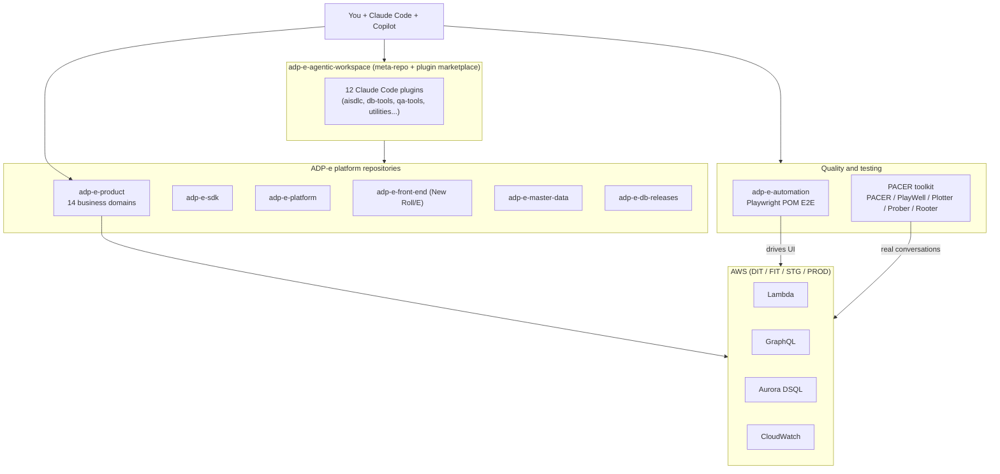

# 01 - Getting Started with Projects

> Who you are, what you build, how you work, and what your current AI setup looks like.
> Covers tasks.md steps 1-3. Everything here comes from files that were actually read (sources listed in section 0).
> Anything not confirmed from a file is marked `{NOT SURE}`.

---

## 0. Sources read

| Source | What it covers |
|---|---|
| `.arog/my-stuff/tasks.md`, `start-with-me.md` | Goal, task list, stack, PACER overview |
| `.arog/my-stuff/main-project/01.md` - `06.md` | 6-module course on `adp-e-product` (domains, actors, GraphQL, DSQL, AWS, build/ship) |
| `.arog/my-stuff/project1-claude.md`, `project1-readme.md` | `adp-e-agentic-workspace` (the meta-repo and plugin marketplace) |
| `.arog/my-stuff/project2-claude.md` | `adp-e-product` CLAUDE.md (full architecture, build, deploy, git flow) |
| `.arog/my-stuff/project3-claude.md`, `project3-readme.md` | `adp-e-automation` (Playwright QA framework) |
| `.arog/my-stuff/pacer-claude.md`, `pacer-readme.md` | PACER toolkit (PACER, PlayWell, Plotter, Prober, Rooter) |
| `~/.claude/CLAUDE-ME.md`, `FRAMEWORK-FEATURE-FLAGS.md`, `STATE-SNAPSHOT.md`, `my-notes.md`, `ar-config.yaml` | Your current (legacy) framework, named AROG in CLAUDE-ME.md: process, rules, flags, daily ritual, config |
| `~/.claude/{skills,agents,commands,hooks,templates,bin}`, `settings.json`, `settings-me.json` | Your current AI tooling inventory |

---

## 1. Who you are and what you want

- **Arogya Reddy (Gade)** - Senior Lead Software Developer at ADP. Co-owner of the PACER repo.
- **Platform:** ADP-e (ADP Employee Experience, product name "Roll"). Payroll, HR, policy management, worker lifecycle.
- **Current focus domains:** HR (organization policy, worker lifecycle), plus the agentic conversation engine testing (PACER).
- **Goal (from tasks.md):** a systematic, reusable, repeatable, organized platform for using AI (Claude Code and GitHub Copilot) across
  development, coding, testing, building and daily work. Delivered as one folder, **axon** (`~/.claude/.arog/axon/`), that you copy and start using. The new framework is deliberately NOT named after you and uses no `ar-` prefix; see section 12.

---

## 2. The work landscape in one picture



---

## 3. Project A - `adp-e-product` (main project)

### 3.1 What it is
The main business-domain monorepo. 14 independent domains that all share one foundation (`src/shared/`) and one
event-and-conversation pattern. Learn one domain and you know the shape of all 14.

```
src/  accounting benefits core crm hr insurance leave payroll staffing support system talent testing time  + shared/
meta/ (separate package: metadata -> DynamoDB)      i18n/ (translations, -en.json / -es.json)
```

### 3.2 Anatomy of one domain (the "cast of characters")

| Role | Folder / file | Job | Never does |
|---|---|---|---|
| Conversation (controller) | `controllers/**/<noun>.<verb>.ctrl.tsx` | Chat UI, asks questions, collects input | Never writes to the database |
| Event | `events/<noun>.<verb>/` | All validation and all DB writes, fixed lifecycle | Never renders chat |
| API | `api.ts`, `api/` | Routes canonical + request type | No business logic |
| Triggers | `triggers/` | Background/async work | Not part of a live chat |
| Skills (state decision) | `skills/<canonical>/evaluateStateDecision.ts` | Agentic flow state transitions | - |
| Experiences | `experiences/<noun>.<verb>/` | Metadata-driven workflow screens | Optional |
| Grids | `grids/` | Read-only data tables | No writes |

- A **canonical** is a fixed `noun.verb` name (for example `organizationPolicy.create`, `payroll.submit`, `worker.hire`).
- Registration: every event exports `getEventStructures()` with `EventFactory.getContext({ countryCode: '00' })` (`00` = global; `US`, `IE` = country overrides).
- Controllers extend `BaseBusinessController`, implement `onStart()`, send `<PlainTextMessage>` via `this.sendChatMessage()`, end with `this.done()` or delegate to `SubController.create({ onEnd })`.
- Routing: `controllers.ts` (Lambda + registry) -> barrel `index.ts` -> `.ctrl.tsx` -> `onStart()` -> `done()`.

### 3.3 The fixed event lifecycle (never reordered, never partially skipped)

```
initialize() -> validateInput() xN -> validateEvent() -> setWorkArea() -> setOutput()
  -> setTitle() -> setSummary() -> preCommit() -> commit() (-> postCommit())
```

### 3.4 Read path - GraphQL
- Always `this.session.api.query({ query, variables })`. Always a read, never a write.
- Many reads are deliberately **fail-open**: log with `this.log.warn/error`, return `null` or a safe default, keep going.
- Query endpoint and mutation endpoint are different URLs (keys `gql_endpoint_*` vs `gql_mutation_endpoint_*` in `ar-config.yaml`).

### 3.5 Write path - Aurora DSQL (bi-temporal)
- Only `commit()` writes. Nothing is overwritten: "update" = close the old row's validity window, then insert a new row.
- Every insert sets `_ValidityStartDateTime`, `_ValidityEndDateTime` (`9999-12-31` = current), `_TransactionStartDateTime`, `_TransactionEndDateTime`.
- Active-row filter: `_ValidityEndDateTime IS NULL OR _ValidityEndDateTime >= '9999-12-31'`.
- `ClientID` always from the session, `EventID` always `this.eventID`, `VersionNumber` hardcoded `1` on create. Never from user input.
- Check `affectedRows` and throw on anything but the expected count. Use `escape()` in raw where clauses.

### 3.6 Infrastructure - AWS and the 3-store rule

| Store | Holds | Written by |
|---|---|---|
| Aurora DSQL (`data.*`) | Business data | `commit()` only |
| DynamoDB via `meta/` | Metadata: vocabulary, UI labels, grid wiring, NLU phrases | Separate `meta/` build and `load-meta` deploy |
| CloudWatch Logs | Every `this.log.*` call | Automatic |

AWS SDK v3 clients in use: Lambda, S3, DynamoDB, CloudWatch (+Logs), Cognito, SES v2, AppConfig, Connect, Location, Pinpoint, QuickSight, EC2, ECS.

Lambda names: `{ENV}-adp-e-{event|ctrl|api|triggers|skills}-{domain}`, experiences `adp-e-exp-{name}`, grids `adp-e-grid-{name}.read`.

### 3.7 Build, test, lint (verified command strings)

```bash
make root && make shared          # always first, in this order
make -j 6 all | make -j 6 <domain> | make -j 6 meta | make -j 6 i18n | make clean
npm run compile | check-controllers | check-controller-types | check-event-types | lint | lint:fix
npm run detect-circular-dependencies | plint | lint:boundaries (per domain)
TEST_BUSINESS_DOMAIN=<domain> npm test         # tests are **/*.spec.ts under tests/
npm run load-meta -- FIT | meta-status | i18n:run | switch
```

- Import boundaries (`boundary.config.json`): controllers cannot import events; events cannot import controllers; `shared` imports no domain layer; `meta/**` is build-time only.
- Test import depth from `tests/{domain}/events/{noun.verb}/` is 4 levels: `../../../../src/`.

### 3.8 Git flow and shipping
- Branch drives deployment via Jenkins (`bin/echo-package.sh` maps branch -> package):
  `master`/`latest` -> `latest`; `product/X.Y.Z`; `pilot/<ver>/<Name>` (STG only, no DB migration, no alias update); `feature/<base>/<desc>`.
- Commit format: `TICKET - MODULE - Short description` (imperative). MODULE optional.
- Husky git hooks in repo. Event specs live under `docs/<domain>/<service>/<feature>/<function>/events/<event>/` (business language only).
- `graphify-out/` knowledge graph (45K nodes) - the repo CLAUDE.md makes "query the graph first" a blocking rule.

---

## 4. Project B - `adp-e-agentic-workspace` (meta-repo)

- Standard environment for everyone on ADP-e (devs, BAs, QA, perf, ops, PMs). Clones up to 10 repos via `./tools/setup-repos.sh`
  ("Full Platform Stack" or "Product Development Only").
- **12 plugins** served as a Claude Code marketplace (`adp-e-agentic-workspace`), already enabled in your `settings-me.json`:

| Plugin | Skills (examples) |
|---|---|
| adp-e-aisdlc (13) | event-from-spec, event-spec-builder, e-spec-from-event, e-spec-verify, event-graphql-verification, grid-from-spec, facts-query-gen |
| adp-e-database-tools (1) | db-connect (DIT/FIT/STG) |
| adp-e-doc-tools (4) | e-markitdown, create-power-point, export-events-from-doc-to-md, start-federated-doc-work |
| adp-e-knowledge-base (3) | event-explainer, qna, embedded-forms |
| adp-e-qa-tools (3) | e-automation, qa-tracker, e-must-test |
| adp-e-quality (1) | pr-review |
| adp-e-release (3) | e-show-package-inventory, manifest-analyzer, release-notes-builder |
| adp-e-utilities (8) | dev-setup, code-explorer, e-locksmith, claude-feature-builder, trac-management, e-ownership, link-check, intent-description-generator |
| teams: client-success, cool-cats, front-end, teamml | graphql-query-analyzer, prod-alert-researcher, e-daily-platform-report, lambda-log-level, pr-review-front-end, pr-review-mlteam |

- **Front-end rule:** until migration ends, every front-end fix goes in BOTH legacy Roll (`adp-e-platform/services/adp-e-front-end/`) and New Roll/E (`adp-e-front-end/packages/apps/`).
- **AWS environments:** DIT, FIT, STG, PROD (+ HF on FIT account, SB on STG account, PRT on PROD account). Region `us-east-1`. Auth `e-cli awsrole login --all` (12 h expiry). Resource naming `{ENV}-resource-name`.
- **Trac** ticketing via `/trac-management` (needs `TRAC_USERNAME`, `TRAC_PASSWORD`).

---

## 5. Project C - `adp-e-automation` (Playwright E2E QA)

- Playwright 1.45 + TypeScript, Page Object Model, owned by Roll QA. Tests the full small-business payroll lifecycle through the **chat UI**.
- Core engine: `chatPage.findNextQuestion({ testData, conversation })` - listens to WebSocket messages from the e-bot, regex-matches
  the question in `testData`, dispatches to a controller (text, dropdown, date...) and loops until done or `showStopper`.
- Intent keys live in `constant.ts` (`hire`, `payroll` -> `>>start payroll.run`, `terminate`, `W4`...).
- Backend verification: `gql.waitForEvent({ canonicals, eventStatus, checkAllEvents })`; timeline checks via `timelinePage.checkForTimelineNotification()`.
- Test data from `QA.TestCase` DB (DIT) by `TAG` or `TestCaseID` -> `test.json`; always `(await loadJSON()) || defaultJSON`.
- **Run only with `npm start`** after editing `.env` (`TAG`, `E_TESTS_ENV`, `E_TESTS_STATE`). Never `npx playwright test` directly.
- Jenkins job `QA-PLAYWRIGHT-AUTOMATION-pipeline-ecs`; metagen sync `utils/syncMetagenToDB.sh`.

---

## 6. Project D - PACER toolkit (`adp-e-agentic-automation`)

**PACER** = Persona, Agent, Conversation, Evaluate, Report. Tests the ADP e-conversation-engine with real multi-turn conversations against live FIT.

| Tool | What it does | Where |
|---|---|---|
| PACER | Real conversations over the API, scored against YAML flow contracts | `runner/pacer_runner.py`, `runner/flow/*.yaml` |
| PlayWell | Same flow through a real Chromium browser at `https://e.fit.adpeai.com/agentic` | `playwell-engine/` (TS), `runner/dashboard/playwell_*.py` |
| Plotter | Create / validate / score (0-100) / repair flow YAML | `runner/pacer_plotter.py`, `runner/dashboard/playwell_plotter.py` |
| Prober | Intent/routing checks + API contract checks (24 endpoints, 17 default) | `intent_routing_runner.py`, `runner/api_contract/`, `api_runner.py` |
| Rooter | Front door: routes a question to the right tool | skill `rooter` |

- Chain: Plotter-authored flow YAML (source of truth) -> PACER (API) or PlayWell (browser) -> checked against Arize AX spans and the Data Bridge (real GraphQL/DSQL/CloudWatch).
- Engine: `--engine agui` (AG-UI, SSE, AWS Strands) is required for `worker.hire` and is the default.
- Dashboard: Python stdlib server `:8766` (no hot reload) + Next.js 16 UI `:3001`. Feature flags `runner/flags.yaml` + `flags.local.yaml`.
- Ships its own skills/agents for **both Claude Code and Copilot** (pacer, pacer-run, playwell, plotter, prober, prompter, rooter, arize skills). Copilot sessions traced to Arize AX.
- Pitfalls: never run a second command during a live run; Playwright `getByRole/getByText` must use `{ exact: true }`; never `shell=True`; never edit flow YAML to hide an engine bug.

---

## 7. Your stack

| Layer | Technology |
|---|---|
| Languages | TypeScript, JavaScript, Python (PACER), Go (e-cli) |
| Backend | Node.js on AWS Lambda, `@adplabs/e-event-engine`, `e-engine-core`, `e-product-sdk` |
| API | GraphQL (query + mutation endpoints) |
| Data | Aurora DSQL (bi-temporal), DynamoDB (metadata), MySQL/Aurora (legacy), Redis |
| Observability | CloudWatch Logs, Arize AX (LLM spans) |
| Auth | Cognito (USER_PASSWORD_AUTH), ADP SSO |
| Front end | React 16.14, Next.js 16 (PACER dashboard), Vue (not used by you) |
| Testing | Jest, Playwright, pytest, vitest |
| Build / CI | GNU Make, npm, pnpm, esbuild, SWC, Jenkins, Bitbucket |
| AI tools | Claude Code (Bedrock, Sonnet per CLAUDE-ME), GitHub Copilot (VS Code / Insiders) |

---

## 8. Your current process (legacy "AROG v1", from `CLAUDE-ME.md`; axon replaces it)

```
ANALYSE -> PLAN -> SHOW -> APPROVAL -> TESTS (RED) -> IMPLEMENTATION (GREEN) -> REFACTOR (BLUE)
```

| Rule | Meaning |
|---|---|
| 1 - No test = no code | Failing test first, shown FAIL, then implement. Test approval gate file `~/.claude/.test-approval-this-session`. |
| 2 - No understanding = no start | Plan in `~/.claude/docs/plans/<slug>.plan.md`, post the gate block, wait for GO. |
| 3 - No reproduction = no bug fix | Repro test first; `~/.claude/.bug-hunt-session-active` unblocks edits. |
| 4 - Done = done verified | `/ar-verify` then `/ar-review`, show both outputs. |
| 5 - Guard (legacy "AROG Guard") | No silent assumptions, minimal solution, no orthogonal changes, confirm before irreversible. |
| 6 - No guessing | Ask; if unknown, write `{NOT SURE}` and stop on that point. |

- **Document output rule:** all generated docs under `~/.claude/docs/<type>/` (plans, reviews, code-reviews, guides, specs, sessions...). Only exception: `{project}/.arog/ar-config.local.yaml`.
- **Feature flags:** `#ChatOutput`, `#DocumentCreation`, `#BetterExplanation`, `#PseudoCode`, `#GroundWork`, `#BeProActive`, `#ExplainWithResults`, `#FlagStatus` (session-scoped, must be acknowledged first line).
- **Skill routing:** new code/bug -> `/ar-tdd`; ADP event -> `/ar-event-from-spec` -> `/ar-event-code-reviewer`; review -> `/ar-code-reviewer`; pre-commit -> `/ar-verify`; post-session -> `/ar-review`.
- **Daily ritual (my-notes.md):** open dashboard (`arog`, `http://127.0.0.1:47301`), check Command Center; `git status` + AWS session check before adp-e-product; `ar-verify.sh` must say ALL CLEAR before commit; end of day check Health tab.
- **Global user rules (CLAUDE.md):** no em dash; no AI co-author in commits; never edit CHANGELOG/auto-generated files; prefer quality over dev cost; reproduce bugs E2E first; pixel-perfect UI; fix lint/test/flakiness you see.

### 8.1 Platform mandatory rules (from incidents)
Known from `main-project/06.md` and `ar-understand/REFERENCES.md`:
1. `src/shared/` imports need the package in ROOT `package.json`.
2. Touching `meta/src/` requires `make meta` + `npm run load-meta -- FIT` before push (stale build fails silently).
3. Every `translate()` key must exist in both `-en.json` and `-es.json` (missing key renders the raw key in prod).
4. Event lifecycle order is fixed.
5. `ClientID` / `EventID` / `VersionNumber` never from user input.
6. UUIDs generated only in `setOutput()`.
7. Every insert sets the 4 bi-temporal fields.
8. Never tell anyone "reload and test it yourself" - verify with real tools.

`ar-understand` refers to "12 mandatory rules" in `~/.claude/rules/adp-e-product/mandatory.md`; that file is not on this machine. Rules 9-12: `{NOT SURE}`.

---

## 9. Current AI tooling inventory (`~/.claude` on this Mac)

There are really **three families** mixed together today:

| Family | Items | Origin |
|---|---|---|
| **Legacy AROG (ar-*)** - ADP-focused, heavy process | 20 `ar-*` skills, 13 `ar-*.agent.md`, 11 JS hooks + dashboard `hooks/lib/*-panel.js`, `bin/arog*`, `ar-config.yaml`, `master-tools/ar-digest` | Built on the work Mac (`/Users/gadea`) |
| **SCWA "pilot" framework** - generic, light | commands `explain, fix-bug, handoff, plan-feature, resume-work, review, risk-map, setup-project, ship`; skills `work-discipline, demanding-proof, scientific-debugging, framing-vague-requests, ship-safely`; agents `code-reviewer, security-reviewer, verifier`; Python hooks `block-dangerous-commands, protect-files, post-edit-check, audit-log, session-start-brief, stop-handoff-check`; `templates/` | Generic governed-dev framework (session logs mention `scwa-framework`) |
| **Third-party kits kept as resources** | `go-to-dev-kit/` (one router skill + 10 playbooks + 2 agents), `ship-pipeline/` (spec -> test -> verify -> review gate with Node scripts), `docs/skills-main/` (Matt Pocock skills), `skills/synced/` (account-synced skills, managed elsewhere), `lavish`, `chrome-devtools-axi`, `no-mistakes`, `find-skills` | Downloaded |

### 9.1 Health findings (verified on this machine)

| # | Finding | Impact |
|---|---|---|
| H1 | `~/.claude/settings.json` and `CLAUDE.md` are **symlinks into the nix store** (home-manager). Active settings only run `lavish-axi` on SessionStart plus a context statusline. | None of the AROG / SCWA hooks are actually active here. Anything installed must respect home-manager. |
| H2 | `settings-me.json` (the work settings) points to `/Users/gadea/.claude/hooks/pre-tool-use.sh` (missing) and MOLTamp app hooks. | Not portable to this Mac. |
| H3 | Referenced but missing: `~/.claude/scripts/` (`ar-verify.sh`, `scan-test-quality.mjs`, `gate-check.sh`), `~/.claude/rules/adp-e-product/mandatory.md`, `~/.claude/docs/{plans,reviews,code-reviews,global}`, gold-standard `demo-review-notes-2026-07-14.md`, `moltamp-statusline.sh`. | `/ar-verify`, `/ar-understand` and others cannot run fully. |
| H4 | 8 files hardcode `/Users/gadea` (`ar-config.yaml`, `settings-me.json`, `ar-mindmaps`, `ar-explain-changes`, `ar-verify.agent.md`, `hooks/lib/monitor-panel.js`, `bin/meeting-notes-menubar.py`). | Breaks on any other machine. |
| H5 | `/ar-verify` skill says "lint -> tsc -> tests -> slop-scan, pure shell", but `agents/ar-verify.agent.md` is named `ar-verify-done` and is an ai-sdlc stage-gate verifier. | Name/behavior mismatch. |
| H6 | `skills/ar-understand/UNDERSTAND-TEMPATE.md` (typo) while the agent reads `UNDERSTAND-TEMPLATE.md`. | Template silently not found. |
| H7 | Overlap: 6+ planning entry points, 7 reviewers, 4 verifiers, 3 status lines, 3 session-continuity mechanisms, 2 dangerous-command guards. | Confusing routing, token waste. |
| H8 | `settings-me.json` has `skipDangerousModePermissionPrompt: true`. | Security risk at work. |
| H9 | `ar-config.yaml` mixes shareable structure with internal endpoints, client IDs, Cognito pool IDs, user emails. | Must never be copied into a shareable folder. |
| H10 | Toolchain on this Mac: `node 24`, `python3 3.9`, `jq`, `claude`, `lavish-axi` present; `uv`, `just`, `bun`, `playwright-cli`, `gh`, `pi` missing. | The resource repos assume uv/bun/just. |
| H11 | Installed Claude Code is **v2.1.197**. The current docs (code.claude.com, fetched 2026-09-30) describe features that need newer versions: `attribution: false` (2.1.281), `claude plugin eval` (2.1.269), reading `AGENTS.md` directly (2.1.277), output style / monitor validation (2.1.283), built-in auto mode default (2.1.228). | axon must pin a minimum version and `doctor` must check it. |
| H12 | VS Code Copilot can read Claude-format files: `.claude/skills`, `.claude/agents`, `.claude/rules`, `CLAUDE.md`, and hooks in `.claude/settings.json` / `~/.claude/settings.json` when `chat.useClaudeHooks` is on (that setting is off by default, and the Local harness ignores matchers). Source: code.visualstudio.com/docs/copilot/customization/hooks, custom-instructions, agent-skills, custom-agents. | Copilot parity can reuse the same files, but only project/user-scope files, not assets that live inside a Claude plugin. |

---

## 10. Glossary

| Term | Meaning |
|---|---|
| Canonical | `noun.verb` operation name, e.g. `worker.hire` |
| Controller / conversation | `.ctrl.tsx` chat flow class |
| Event | Business-logic class with the fixed lifecycle, only writer to DSQL |
| Bi-temporal | Validity window + transaction window on every row; close-and-insert instead of update |
| Fail-open | On read failure, log and continue with a safe default |
| Meta | Separate metadata package deployed to DynamoDB |
| FIT / DIT / STG / PROD | ADP environments (FIT is your main test env) |
| AG-UI | SSE agent chat backend (AWS Strands) used by the agentic UI |
| Flow contract | PACER YAML (`states/collects/tools/next`) describing an expected conversation |

---

## 11. Open questions raised by this analysis

1. Rules 9-12 of `rules/adp-e-product/mandatory.md` - can you copy the file from the work Mac? `{NOT SURE}`
2. Are `~/.claude/scripts/*` and `hooks/pre-tool-use.sh` on the work Mac, or should axon rebuild them? `{NOT SURE}`
3. Is home-manager also used on the work Mac? `{NOT SURE}`
4. Which Claude Code version does the work Mac run, and can it be upgraded? `{NOT SURE}`

---

## 12. Naming: axon

- The new framework is named **axon**. The name appears only where Claude Code needs a technical label: the folder `~/.claude/.arog/axon/`, the marketplace `axon`, the plugin names (`axon-core`, `axon-guard`, `axon-qa`, `axon-learn`, `axon-adp`, `axon-observe`, later `axon-factory`), hook message tags such as `[axon-guard]`, `AXON_*` environment variables, and the `axon` installer CLI.
- Skills, agents and commands inside the plugins have **no prefix**. Your own names stay without `ar-` (`understand`, `plan-track`, `tdd`, `go-until-done`, `agent-council`...); unclear resource-repo names are renamed (`ui-review` > `ui-acceptance`, `playwright-bowser` > `playwright-browser`). The design is inline-first with code-checked steps: skills run in your session, hooks and scripts enforce the rules, and only 4 agents exist (`verifier`, `reviewer`, `qa-agent`, `council-advisor`), chosen from the measured POC in `04-poc-results.md`. Claude Code namespaces plugin skills as `/axon-core:understand`, so they never collide with personal skills. The full catalog, the reasoning, and the fate of every legacy and resource-repo item are in `03-component-catalog.md`.
- "AROG" in this document refers only to your **legacy** setup that axon replaces.
