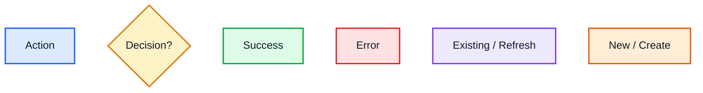

# Mermaid Reference for Simple Code Mentor

## Safe Mermaid rules

- Use `flowchart TD`.
- Use simple node labels.
- Use `A[Action]` for actions.
- Use `B{Question?}` for decisions.
- Use `-- Yes -->` and `-- No -->` for condition paths.
- Keep one diagram per fenced code block.
- Do not nest Mermaid inside another fenced block.

## Color classes

