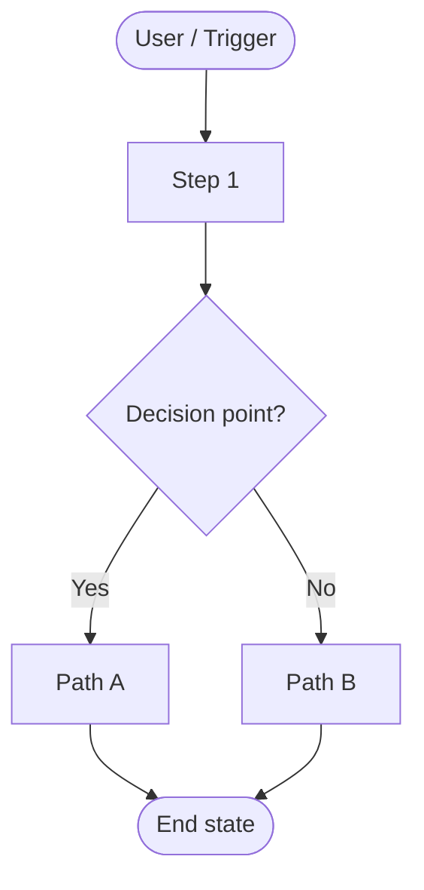
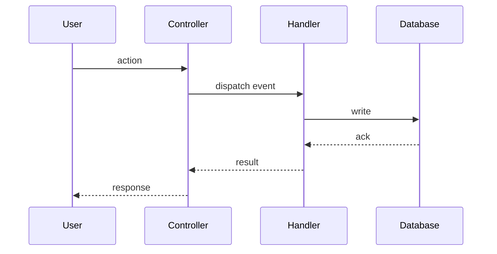
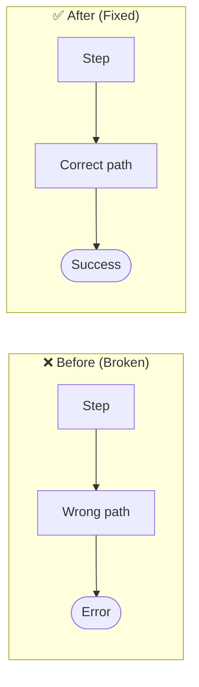
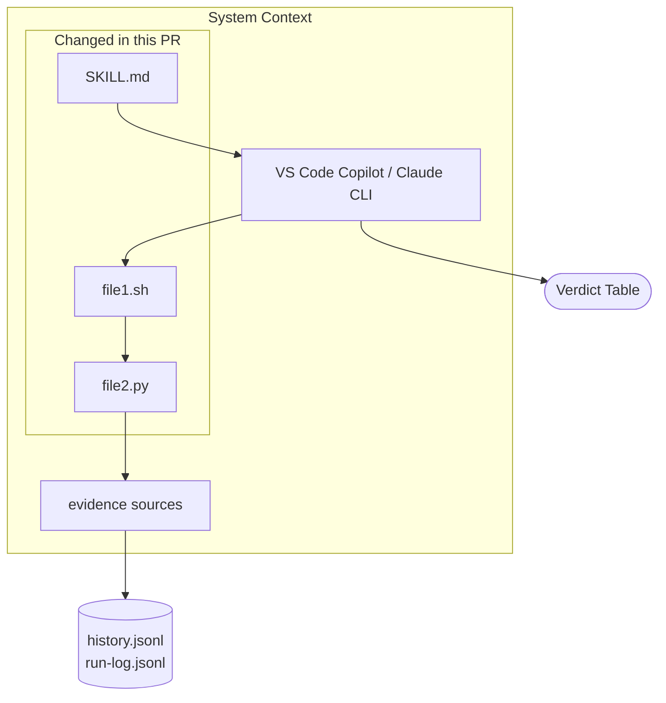

# Change Documentation: {slug}

> **Generated by explain-changes** - {full date, e.g. May 29, 2026}

---

## 📋 Quick Reference

| Field                     | Value                                                     |
| ------------------------- | --------------------------------------------------------- |
| **Date**                  | {MM/DD/YY}                                                |
| **File(s)**               | `{file_path(s)}`                                          |
| **Function(s)**           | `{changed_function_names}`                                |
| **Change Type**           | Bug Fix / Refactor / Feature / Hotfix                     |
| **Risk Level**            | Low / Medium / High                                       |
| **Severity (before fix)** | Critical / High / Medium / Low                            |
| **Commit**                | `{SHA if available, else "pending"}`                      |
| **Branch**                | `{git branch name}`                                       |
| **Investigation Source**  | {Session memory / Transcript / Caller context / Git-only} |

---

## 0. Session Investigation Story

{Narrative of how this issue was found and diagnosed. Written in past tense as a story.
Sourced from SESSION_CONTEXT built in STEP 0b - session memory, transcript, and caller context.

Structure:

- **What was reported**: {the symptom as described by the user or ticket}
- **First investigation**: {what was looked at first and why}
- **What was ruled out**: {hypotheses tested and eliminated, with reason}
- **The breakthrough**: {the key evidence or observation that revealed the actual root cause}
- **Confirmation**: {how the root cause was confirmed before fixing}

If session_source is `git-only`, write:

> Investigation path derived from git history and code analysis only.
> No session transcript or AI memory was available for this change.}

---

## 1. Executive Summary

{2–3 sentence plain English summary. What was broken, what was changed, what works now.
Write this so a PM or non-technical person can understand it in 30 seconds.}

---

## 2. The Problem - What Was Wrong

### Symptom

{What the user/developer saw. UI error messages, broken flows, error codes, wrong behavior.}

### Scope of Impact

{Who was affected? All users? Specific role? Every delete attempt? Only in certain states?}

### When Did It Start?

{Known since: / introduced in commit: / unknown}

---

## 3. Root Cause Analysis

### Direct Cause

{The specific line/argument/logic that caused the failure. Be precise.}

### Why Did It Fail?

{Technical explanation. What did the bad code do at runtime? Why does the system react that way?}

### Why Was This Code Wrong in the First Place?

{Was it a misunderstanding of the API? A copy-paste from an older pattern? A breaking change in a dependency?}

---

## 4. How Was It Identified

{Debugging process. How did investigation narrow down to this root cause?
Describe the path: symptom → hypothesis → verification → confirmed root cause.}

---

## 5. The Change - Before vs After

### Files Changed

{List each file with a one-line description of what changed in it.}

### Before (Broken Code)

```typescript
// BEFORE - what the code looked like before the fix
{exact code snippet from the diff - before state}
```
````

**Why this was wrong:**
{1–3 bullet points explaining exactly what the old code was doing incorrectly}

### After (Fixed Code)

```typescript
// AFTER - what the code looks like after the fix
{exact code snippet from the diff - after state}
```

**Why this is correct:**
{1–3 bullet points explaining why the new code works}

### Diff Summary

{Plain English diff description. E.g.: "Removed `clientID` and `activeOnly: true` arguments
from the GraphQL query. The `organizationPolicy` resolver only accepts `organizationPolicyID`."}

---

## 6. Why This Fix Works - Technical Explanation

{Deep-dive into why the fix is correct. Reference the GQL schema, the resolver contract,
the event pattern, the validation logic - whatever is relevant.
Explain the chain: fix → correct data returned → correct downstream behavior.}

---

## 6a. Feature / Change Flow Diagram

Draw the complete execution flow of what was built or fixed.
**ALWAYS include at least one Mermaid diagram in this section.**

Choose the most appropriate diagram type:

### For feature builds (new capability), use a flowchart:



### For data flows through the system, use a sequence diagram:



### For before/after state changes, use two side-by-side flowcharts:



### Rules for diagrams:

- Use real names from the code (function names, event names, file paths)
- Mark the broken path in BEFORE diagrams with ❌ or red labels
- Mark the fixed path in AFTER diagrams with ✅ or green labels
- For multi-file changes, show how the files interact (sequence diagram is best)
- For new features, show the complete happy path + key failure branches
- For bug fixes, show what the execution looked like before vs after
- Add a second diagram if needed (e.g. one for data flow, one for component interaction)
- Caption each diagram with a one-line description

### Risk Level: {Low / Medium / High}

| Area                                | Impact              | Reason   |
| ----------------------------------- | ------------------- | -------- |
| {affected area 1}                   | None / Low / Medium | {reason} |
| {other events (create/update/etc.)} | {impact}            | {reason} |

### Files NOT Affected

{List related files that were explicitly checked and confirmed unchanged.}

---

## 8. Expected Outcome After the Fix

{What should now work correctly? Write as bullet points:}

- {outcome 1}
- {outcome 2}
- {outcome 3}

---

## 9. Verification Steps

### How to Confirm the Fix Works

{Step-by-step instructions for a developer or QA to verify the fix in FIT/STG:}

1. {step 1}
2. {step 2}
3. {step 3}

### Expected Behavior After Fix

{What the user should see when the fix is working. Contrast with the broken behavior.}

### Unit Test Coverage

{Are there tests that cover this scenario? Should a new test be added?}

---

## 9a. Architecture / Dependency Diagram

Show WHERE this change lives in the overall system.
**ALWAYS include this diagram for feature builds.**



Rules:

- Highlight the files changed in this PR inside a subgraph labeled "Changed in this PR"
- Show their connections to other system components
- Use `[(storage)]` notation for files/databases
- Use `([event])` notation for user-facing outputs/triggers
- Add a one-line caption describing the architectural role of this change

### Related Bugs / Issues Not Fixed Here

{Other bugs discovered during investigation that are NOT part of this fix. Include a JIRA ref if known.}

### Lessons Learned

{What should be documented so this class of bug doesn't happen again?}

### References

{Links to GQL schema files, spec docs, other handlers that use the same pattern.}

---

_Document generated by `/explain-changes`_

```

---
